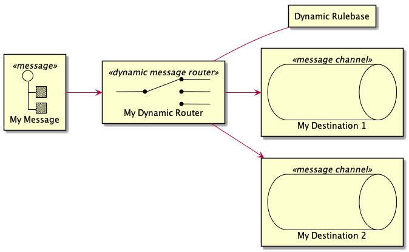
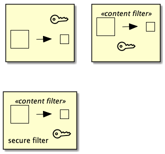
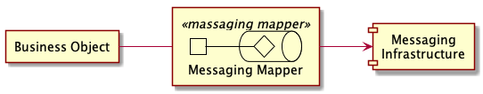

# EIP-PlantUML

EIP-PlantUML provides [Enterprise Integrations Patterns](https://www.enterpriseintegrationpatterns.com/) elements to [PlantUML](http://plantuml.com/) to provide easy support of designing EIP architectures for both, up-front design as well as development-time automated documentation generation.  

## Important Information 

Please bear in mind this repository is currently Work in Progress - therefore new features are added regularly and breaking changes might be introduced more often than not. 


## Getting Started

You will need to download the `EIP-PLantUML.puml` file from the dist folder.  
This files includes everything you need to use the EIP patterns in your PlantUML diagramms.

At the top of your PlantUML model you need to include the `EIP-PlantUML.puml` file.

```c#
!include ../EIP-PlantUML/EIP-PlantUML.puml
```
After including the `EIP-PlantUML.puml` file you can start using the EIP patterns as shown below. 

```c#
MsgChannel(channel1, "Channel 1")
MsgChannel(channel2, "Channel 2")
Message(msg, "Message")

Send(channel1, msg)
Send(msg, channel2)
```


## Supported Pattern 
The following pattern are currently supported:

### Message Construction

* Message 
   * `Message(alias [,label])`
* Command Message
    * `CommandMessage(alias [,label])`
* Document Message
    * `DocumentMessage(alias [,label])`
* Event Message
    * `EventMessage(alias [,label])`
* Request-Reply
    * `RequestReply(alias [,label])`
* Return Address
    * `ReturnAddress(alias [,label])`
* Correlation Identifer
    * `CorrelationIdentifier(alias [,label])`
* Message Sequence
    * `MessageSequence(alias [,label])`
* Message Expiration
    * `MessageExpiration(alias [,label])`
* Format Indicator
    * TBD

### Message Routing
* Pipes and Filters
    * `Pipe(from, to)`
    * `Filter(alias [,label])`
* Message Router
    * `MessageRouter(alias [,label])`
* Message Filter
    * `MessageFilter(alias [,label])`
* Dynamic Router
    * `DynamicRouter(alias [,label], dynamicrulebase)`
* Recipient List
    * `RecipientList(alias [,label])`
* Splitter
    * `Splitter(alias [,label])`
* Aggregator
    * `Aggregator(alias [,label])`
* Resequencer
    * `Resequencer(alias [,label])`
* Composed Message Processor
    * `ComposedMessageProcessor(alias [,label])`
* Scatter-Gather
    * TBD
* Routing Slip
    * `RoutingSlip(alias [,label])`
* Process Manager
    * `ProcessManager(alias [,label])`
* Message Broker
    * `MessageBroker(alias [,label])`

### Message Transformation

* Message Translator
    * `MessageTranslator(alias [,label])`
* Envelope Wrapper
    * `Wrapper(alias [,label])`    
    * `Unwrapper(alias [,label])`
* Data Enricher (also Content Enricher)
    * `DataEnricher(alias [,label], datasource)`
* Content Filter
    * `ContentFilter(alias [,label])`
* Claim Check
    * `Item(alias) <<$claim_check>>`
    * `Item(alias, "<$claim_check>")`
    * `Item(alias, "label <$claim_check>")`
* Normalizer
    * `Normalizer(alias [,label])`
* Canonical Data Model
    * TBD


### Messaging Endpoints

* Message Endpoint
    * `MessageEndpoint(alias [,label])`
* Messaging Gateway
    * `MessagingGateway(alias [,label])`
* Messaging Mapper
    * `MessagingMapper(alias [,label])`
* Transactional Client
    * `TransactionalProducer(alias [,label])`
    * `TransactionalConsumer(alias [,label])`
* Polling Consumer
    * `PollingConsumer(alias [,label])`

### Messaging Channels

 * Messaging Channel
    * `MsgChannel(alias [,label])`
* Point-to-Point Channel
    * `P2PChannel(alias [,label] )`
* Publish-Subscribe Channel
    * `PubSubChannel(alias [,label])`

### System Managmenet

 * Channel Purger
    * `ChannelPurger(alias [,label])` 

## Examples 

### Dynamic Message Router 
The dynamic message router is one of the more complex patterns. To apply this stencil, you must defne the dynamic rule base to be used for this router. 

The following exmaple

```csharp
rectangle "Dynamic Rulebase" as rulebase
DynamicRouter(dynamicrouter, "My Dynamic Router", rulebase)

Message(msg, "My Message")
Send(msg, dynamicrouter)

MsgChannel(queue1, "My Destination 1")
Send(dynamicrouter, queue1)

MsgChannel(queue2, "My Destination 2")
Send(dynamicrouter, queue2)
```
results in the graphic below:



### Claim Check 

The Claim Check pattern can be applied to other patterns. There are several ways, this can done using the EIP-PlantUML as shown by the following example. It can be either used as alternative sterotype, as iconic label or as a label combined with a label text.

```csharp
ContentFilter(filter1) <<$claim_check>>

ContentFilter(filter2, "<$claim_check>")

ContentFilter(filter3, "secure filter <$claim_check>")
```



### Messaging Mapper 

The Messaging Mapper transofrms domain objects into messages required by the messaging mapper and vice versa. 

Therefore, EAI-PLantUML introduces the following metapher for the Messaging Mapper.


The original example introduced by G. Hoppe then can be written like
```csharp
rectangle "Business Object" as obj
component [Messaging\nInfrastructure] as infra
MessagingMapper(mapper, "Messaging Mapper") 
obj -- mapper
Send(mapper, infra)
```



## Background
Enterprise Intergartion Patterns are a set of 65 patterns, mainly based on messaging concepts introduced Gregor Hohpe and Bobby Woolf. The Website [Enterprise Integration Patterns](https://www.enterpriseintegrationpatterns.com/) provides an extensive overview of these patterns. 

These patterns come in handy when dealing with large scale enterprise architectures especially based on messaging systems. 

While documenting large systems with manual tools like Microsoft Visio takes an enourmous amount of time, [PlantUML](http://plantuml.com/) provides an elegant way of coding such architecures top-down or creating documentation based on your source codes. 

There fore the EIP patterns is designed to support this bottom up documentation. The EIP patterns also play well with the [C4-PlantUML](https://github.com/RicardoNiepel/C4-PlantUML) extension by Ricardo Niepel when it comes to Level 4 of the C4 model. 

The [C4 Model](http://c4model.com/) is a elegant way introduced by Simon Brow for describing and communicating software architectures up-front. 

## Feedback

[@aheil](https://twitter.com/aheil)\
[#eipplantuml](https://twitter.com/hashtag/eipplantuml?src=hash)

## Contribution

If interested in contributing to this project, please make sure to read the [Contribution Guidelines](https://github.com/aheil/EIP-PlantUML/blob/master/CONTRIBUTING.md) first. 

## Further References
* [AWS-PlantUML](https://github.com/milo-minderbinder/AWS-PlantUML)
* [Office Icons for PlantUML](https://github.com/Roemer/plantuml-office)
* [Azure-PlantUML](https://github.com/RicardoNiepel/Azure-PlantUML)
